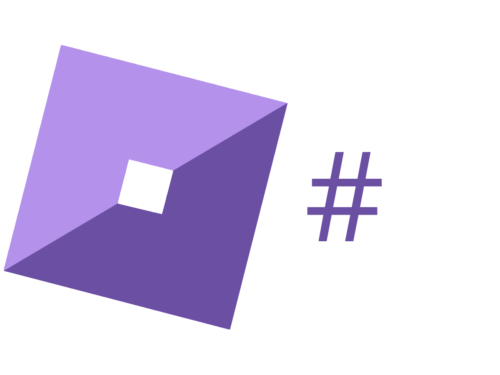

<h1>RoSharp</h1>

An asynchronous API wrapper for the Roblox API written for .NET 6

**NOTE: RoSharp is in active development and may not be stable/complete. I take no responsibility for any harm done with RoSharp**

## Features
- Fully Asynchronous
- Returns results of API calls as custom C# classes

## Usage
### Release

Grab the latest DLL from releases and include it as a reference in your C# project

### Building from source
1. Download the source code
2. Open Visual Studio (Tested with Visual Studio 2022)
3. Change the solution configuration to *Release*
4. Build the project

## Roadmap
- [x] Users API
- [ ] Account Information API
- [ ] Avatar API
- [x] Badges API
- [ ] Catalog API
- [ ] Develop API
- [ ] Groups API

## How to contribute

Either create or find an issue you want to fix and make a pull request. Please document your changes clearly as this makes it easier to approve pull requests

